# Interactive conversion operators

An IDML file is basically a zipped archive of XML files. The structure of IDML editorial content can be abstracted to a XML tree with a depth of one. From that, we want to be able to reconstruct a more complex tree structure to fit the needs of virtually any data schema, in any conversion workflow.

This is where we need **conversion operators**.

Conversion operators, applied on specific nodes, can change the nodes (i.e., their attributes or their name), or the tree structure itself (e.g., by grouping/ungrouping some nodes, or adding/deleting others).

OutDesign will be here to help composing those operations in order to turn one specific schema into another, by designing the conversion in an interactive, visual way, and each operator will require its own visual metaphor.

Some operators apply specifically on nodes, and would not change the structure of the tree, if we consider the tree as just a graph of nodes without properties. We call those operators **element-level operators**. All other operators change the structure of the AST: they all remove or add nodes and edges, or cut the tree into several tree subsets.

**Operators include (work in progress):**

1. Element-level operators

* **type** – _often_ – change the type of an element
* **id** – _sometimes_ – adds a unique `id` to an element for enabling single-element selectors
* **classes** – _always_ – change the classes of an element
* **attrs** – _rarely_ – change the value of one or several attributes
* **level** – _often_ – change the `level` of a Header (Header-specific)
* **simplify** – _rarely_ – remove all attributes from an element

2. Structure-level operators

* **delete** – _often_ – delete an element
* **merge** – _sometimes_ – group sibling elements in one wrapper element
* **join** – _sometimes_ – join the content of a series of sibling elements inline
* **wrap** – _rarely_ – wrap an element in a new parent element
* **unwrap** – _often_ – unwrap an element in its parent
* **empty** – _rarely_ – keeps empty elements (by default, empty elements are removed)
* **br** – _rarely_ – inserts a LineBreak before the element
* **cut** – _sometimes_ – cuts the document before these elements in several output files

# Element-level operators

## type

Frequency: _often_.

By default, every text block in an InDesign document is a paragraph, a `Para` pandoc element, and every inline element is a `Span` pandoc element. But there are many other useful types, obviously. For blocks, we currently support:

1. Block elements:

* `Div`
* `Header`
* `Para`
* `BlockQuote`
* `LineBlock` (a block made of several lines, such as a poem)
* `BulletList`
* `OrderedList`
* `CodeBlock`
* `Note` (footnotes and endnotes)
* `RawBlock` (raw content of a specified format)

2. Inline elements:

* `Link` (URLs and anchors)
* `Code`
* `Span`
* `Superscript`
* `Emph` (generally for italics)
* `SmallCaps`
* `Strikeout`
* `Strong` (generally for bold)
* `Subscript`
* `Underline`

The `type` operator turns regular paragraphs into actual quotes, actual lists, actual headers.

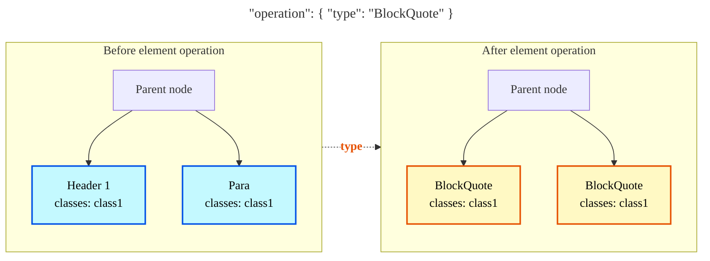

## id

Frequency: _sometimes_.

Adds a unique `id` attribute to the elements selected. It then enables element-specific selectors, useful to handle unique cases.

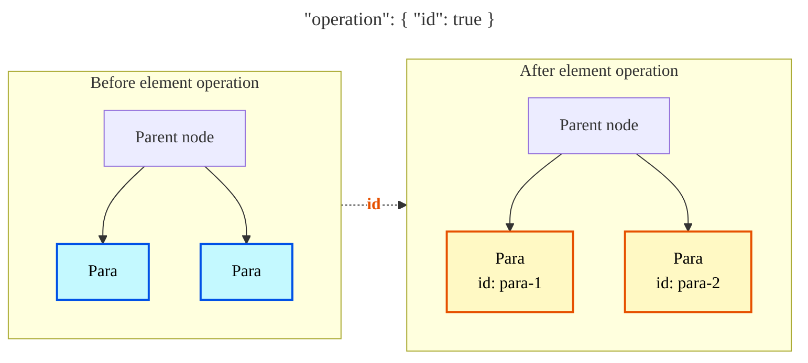

## classes

Frequency: _always_.

Paragraph, character and object styles from the InDesign document are specified as classes. Those classes are central in the selector logics. Classes can be used to:

* Merge paragraph and character styles and overrides into lesser classes and overrides.
* Comply to an existing schema.

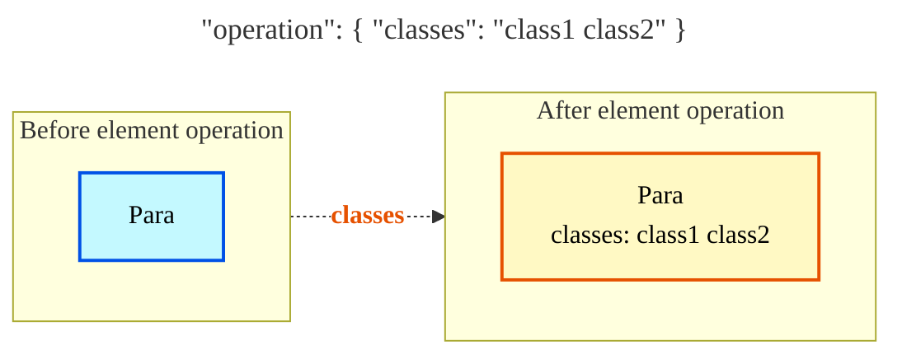

## attrs

Frequency: _rarely_.

Adds or updates an arbitrary list of key/values pairs of attributes.

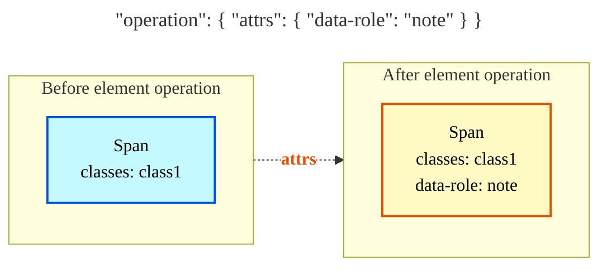

## level

Frequency: _often_.

Sets the level of a Header element. Default value is `1`.

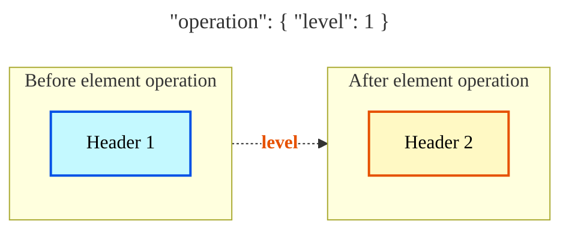

## simplify

Frequency: _rarely_.

Removes all attributes from an element (`id`, `classes` and others).

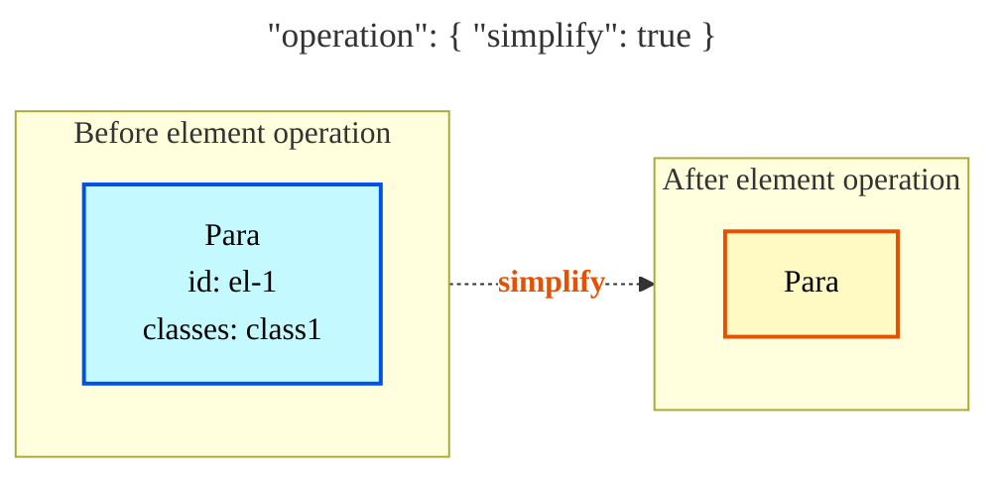


# Structure-level operators

## delete

Frequency: _often_.

Removes an element.

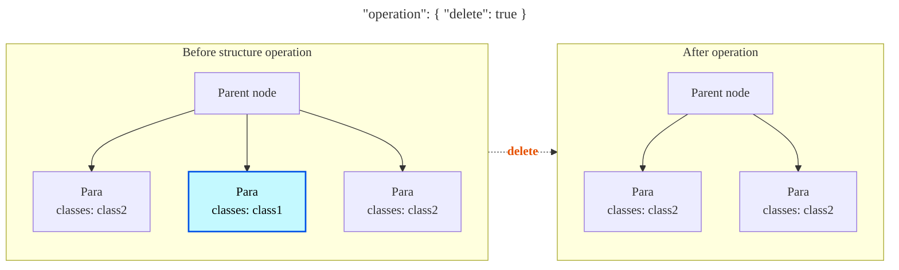

## merge

Frequency: _sometimes_.

Merges two elements under the same umbrella-element. Useful to group `Para` elements as a `LineBlock`, which is necessary for poetry:

```markdown
« Nous allons vous montrer ici, sur cette scène,

Certaine bête d’une ère antédiluvienne,

Le Propriétaire foncier, tel est son nom,

Animal tenu pour inutile et glouton,

Qui s’accrochant en quelques endroits spécifiques,

Y représente une calamité publique ».
```

⬇️ `"merge": `

```markdown
| « Nous allons vous montrer ici, sur cette scène,
| Certaine bête d’une ère antédiluvienne,
| Le Propriétaire foncier, tel est son nom,
| Animal tenu pour inutile et glouton,
| Qui s’accrochant en quelques endroits spécifiques,
| Y représente une calamité publique ».
```

It is also useful for dialogues:

```markdown
– Calliclès : Je ne sais pas quels tours de sophistes tu es en train de faire, Socrate !  

– Socrate : Tu le sais très bien, mais tu fais l’imbécile, Calliclès. Bon, avançons encore un peu. Allons de l’avant !  

– Calliclès : Qu’est-ce que tu as ? Pourquoi t’obstines-tu à parler pour rien ?  

– Socrate : C’est pour que tu saches combien tu es savant, toi qui me reprends ! Donc n’est-ce pas au même moment que chacun de nous cesse à la fois d’avoir soif et de prendre plaisir à boire ?  

– Calliclès : Je ne sais pas ce que tu veux dire.  
```

⬇️ `"operation": { "type": "BlockQuote", "merge": "Div.dialogue" }`

```markdown
<div class="dialogue" markdown="1">

> – Calliclès : Je ne sais pas quels tours de sophistes tu es en train de faire, Socrate !

> – Socrate : Tu le sais très bien, mais tu fais l’imbécile, Calliclès. Bon, avançons encore un peu. Allons de l’avant !

> – Calliclès : Qu’est-ce que tu as ? Pourquoi t’obstines-tu à parler pour rien ?

> – Socrate : C’est pour que tu saches combien tu es savant, toi qui me reprends ! Donc n’est-ce pas au même moment que chacun de nous cesse à la fois d’avoir soif et de prendre plaisir à boire ?

> – Calliclès : Je ne sais pas ce que tu veux dire.

</div>
```

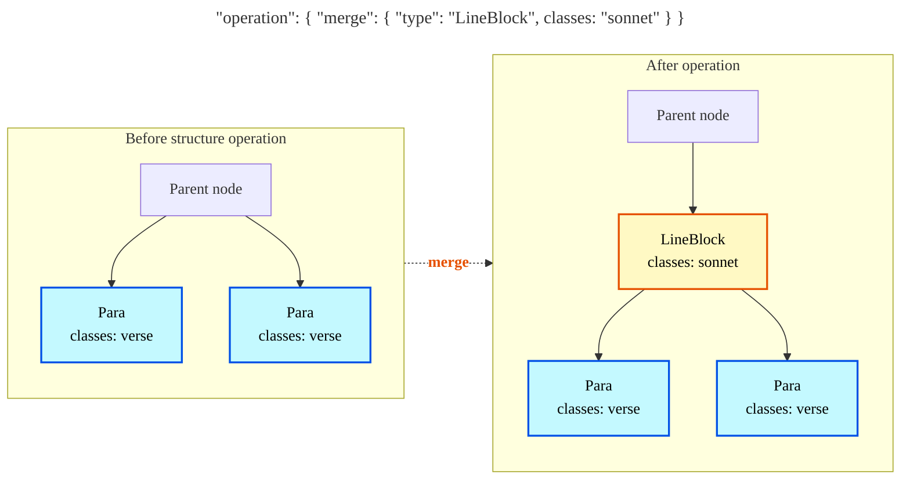

## join

Frequency: _sometimes_.

Useful for Header elements that span over two adjacent elements with different styles:

Or with elements that need to be grouped together under the same element, separated by a `LineBreak`:

```
Karl Liebknecht.

Berlin, le 2 décembre.
```

⬇️ `"operation": { "join": "LineBreak" }`

```
Karl Liebknecht.\
Berlin, le 2 décembre.
```

Sometimes, titles are composed over several lines, and several styles. Here is a common example:

```markdown
 Maitre Puntila et son valet Matti {.style1}

 la comédie chez Brecht {.style2}
```

⬇️ `"operation": { "join": " : " }`

```markdown
 Maître Puntila et son valet Matti : la comédie chez Brecht
```

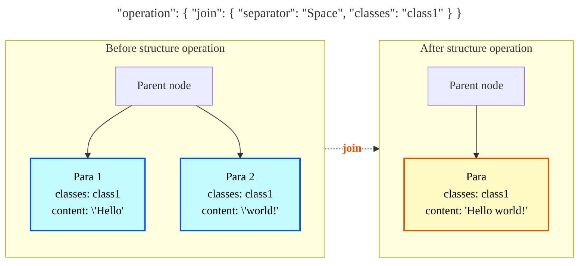

## wrap

Frequency: _rarely_.

Block and inline InDesign elements can only have one attributed style. This operator is useful for inline elements that are, for example, in italics and bold:

```html
<span class="italics-strong">Be yourself.</span>
```

⬇️ `"operation": { "type": "Emph", "wrap": "Strong" }`

```markdown
*_Be yourself._*
```

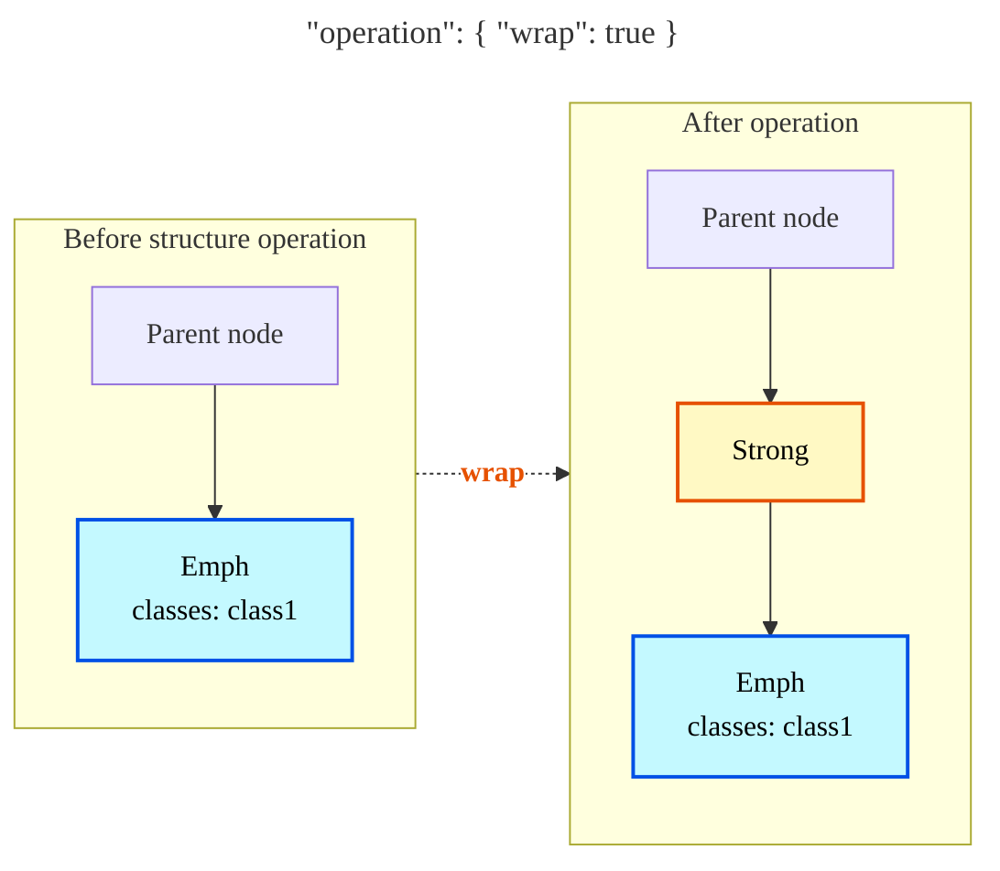

## unwrap

Frequency: _often_.

This operator has different use cases. All attributes are removed and it also acts on the `type` of the element. The element gets replaced by its content. If the content of a block element is made of inline elements, then the block is converted to a `Para`. 

In most cases, it is close to `simplify`, as it is just used to remove all attributes.

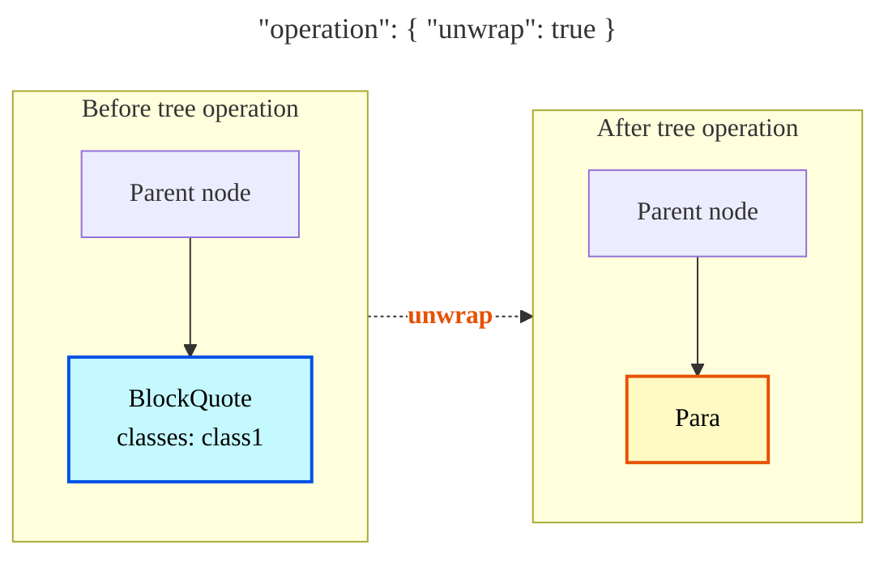

## empty

Frequency: _rarely_.

Keeps empty elements that would otherwise be deleted.

## br

Frequency: _rarely_.

Adds a `LineBreak` elements before an element. Useful for marking a space between some `Para` elements for example.

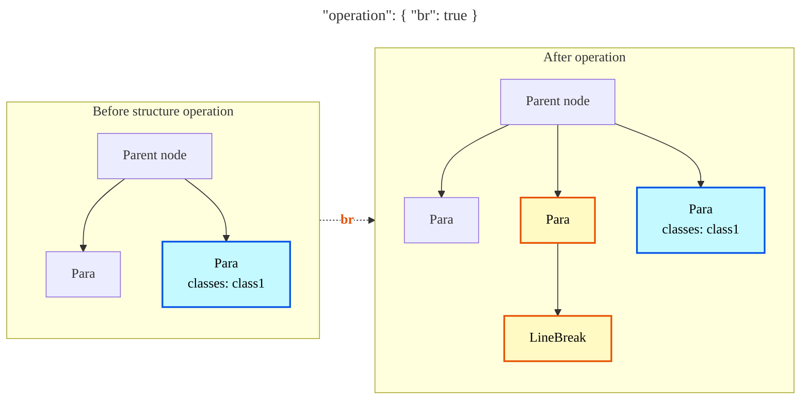

## cut

Frequency: _sometimes_.

Each time an element is met, the file is cut before the element into several output files.

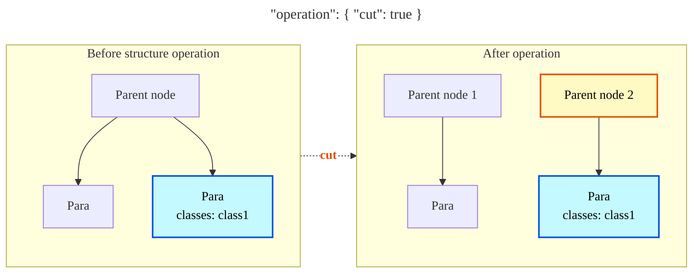