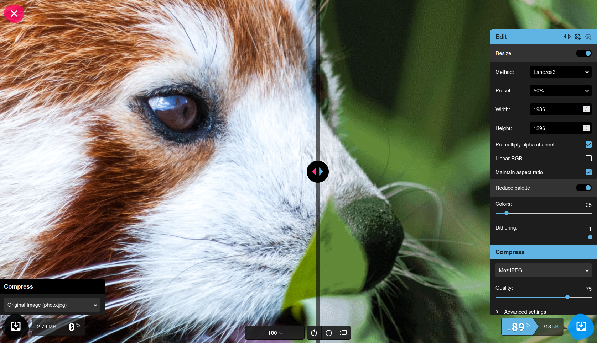
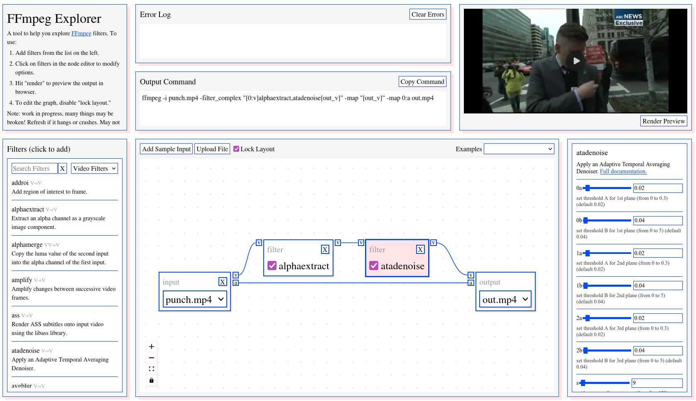
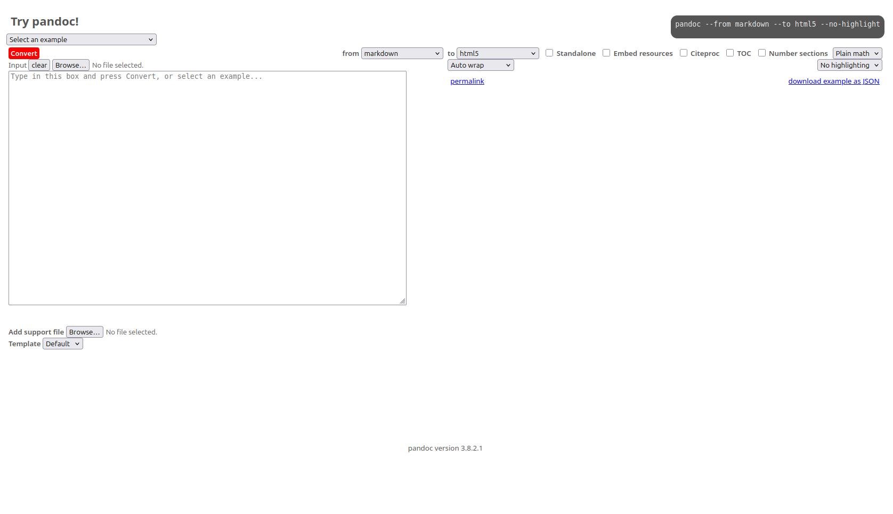
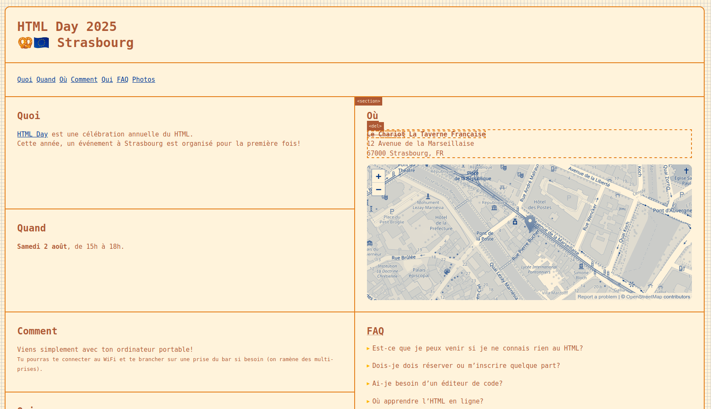
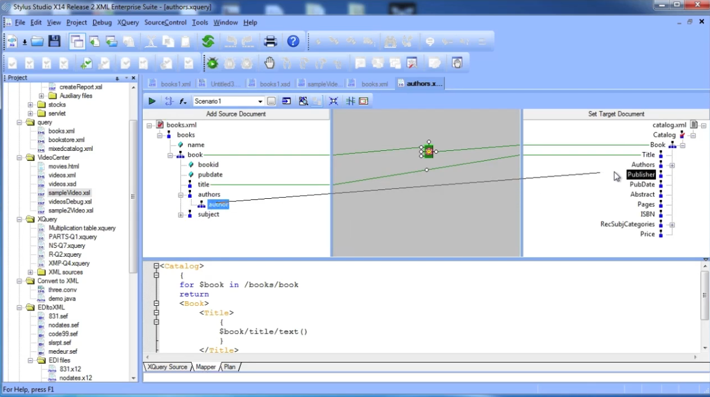
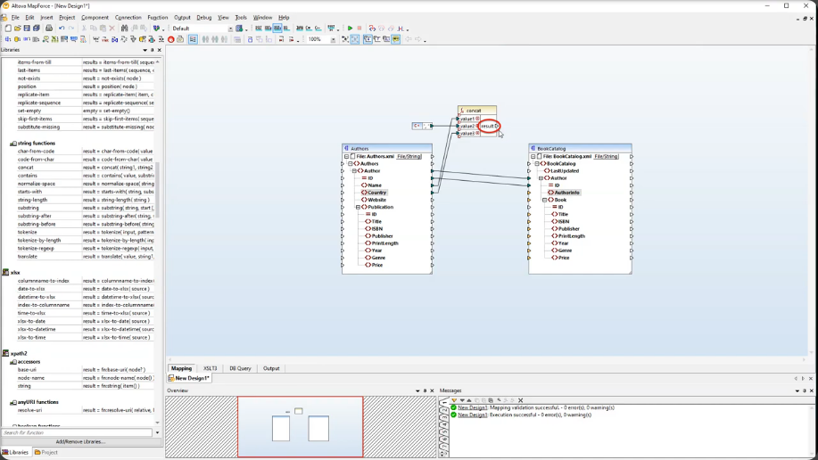
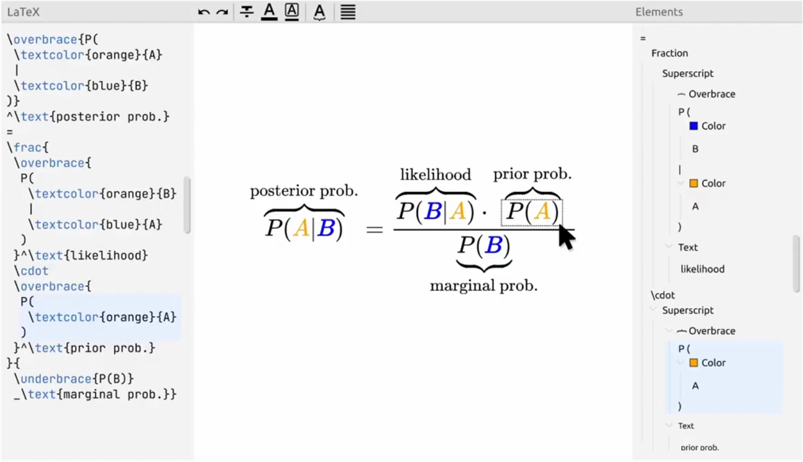
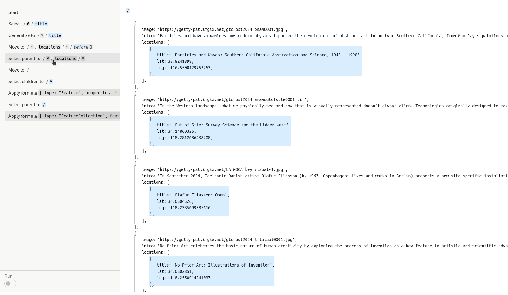

# References

## Pundok Editor

[An interesting example](https://github.com/massifrg/pundok-editor) of a node-and-content tree structure. However, the tree view feels underutilized for now and doesn't seem to fully take advantage of the structure it represents. Notably, it has bridged the Pandoc AST and Prosemirror's Nodes and Marks.

## Squoosh

A clean and user-friendly [interface](https://squoosh.app/) for converting images. For our purposes, it could be adapted to include a final Pandoc command, while replacing the before/after slider (which wouldn't make sense here) with a more relevant comparison or feedback element.

## FFmpeg Explorer

[A helpful tool](https://ffmpeg.lav.io/) for visualizing FFmpeg parameters. In our case, we would want to "group" our parameters more, as it makes complex configurations more accessible for non-expert users.

## Try pandoc!

[A simple online Pandoc playground.](https://pandoc.org/try) It would be interesting to extend this with bidirectionality: starting from a command, parsing it, and loading corresponding interface presets. This could also serve as a way to save and reload interface states.

## Timothée Goguely's HTML Day 2025 Info Page

[A well-structured event page](https://timothee.goguely.com/html-day/2025) that hints at the deeper, underlying semantic structure of a webpage.

## Stylus Studio XML Editor

[A complex XML editor](https://www.stylusstudio.com/) that has [a data mapping editor](https://youtu.be/qDMBn2yFwKM?t=291) embedded.

## Altova MapForce

[Advanced editor for data mapping.](https://www.altova.com/mapforce) Generates execution files out of the UI, general purpose data mapping program. A series of [demos](https://www.altova.com/mapforce/demos) illustrate the mapping process. Most data mapping is not designed for publishing in particular though. The one-to-one mapping is down by uplaoding two files: a source schema and a destination 
schema.

## Adobe FrameMaker

[A document processor](https://en.wikipedia.org/wiki/Adobe_FrameMaker) designed for writing and editing large or complex documents, including structured documents, as a way to perform multiformat publishing of technical and scientific documentations.

## FreeForm

[A tool for designing better math presentations](https://youtu.be/ezyt1khp0VY?t=131) by adding comprehension aids in augmented formulas. It also compares with [FFL](https://dl.acm.org/doi/10.1145/3586183.3606731), a language for styling math formulas.

## Sculpin

[A system to directly manipulate](https://dl.acm.org/doi/10.1145/3746059.3747651) transformations of JSON files to restructure/convert them and apply operations. A [demo](https://sculpin-uist25.github.io/paper.html) can be found online.

## The Sausage Machine

[An experimental system](https://networkcultures.org/publishing-lab/blog/2016/01/04/introducing-the-sausage-machine/) meant to facilitate hybrid text production, part of the [Hybrid Publishing Toolkit](http://networkcultures.org/blog/publication/from-print-to-ebooks-a-hybrid-publishing-toolkit-for-the-arts/). It gives a web interface to Pandoc, and each time a file is dropped, a Makefile is executed to produce several output files.